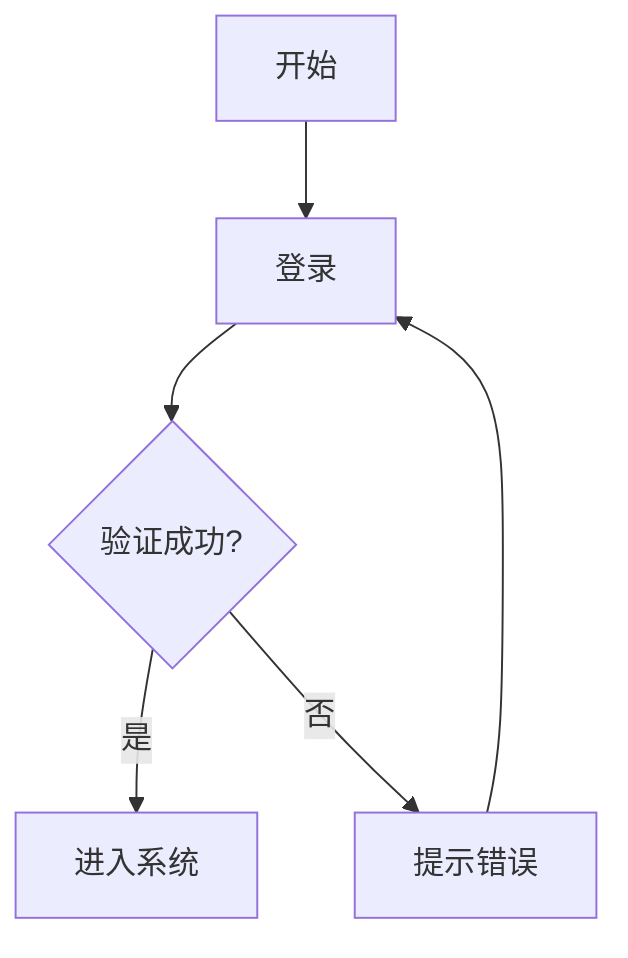

# 文档规范

> 本文档定义了 CodeHubot 项目的文档编写规范，包括代码注释、API 文档和项目文档。

## 📋 目录

- [代码注释规范](#代码注释规范)
- [API 文档规范](#api-文档规范)
- [项目文档规范](#项目文档规范)
- [文档组织结构](#文档组织结构)
- [最佳实践](#最佳实践)

---

## 💬 代码注释规范

### 1. Python 注释规范

#### 模块文档字符串

```python
"""
课程管理 API 模块

本模块提供课程的增删改查功能,包括:
- 课程列表查询(支持分页、筛选、搜索)
- 课程详情获取
- 课程创建、更新、删除
- 课程发布管理

Author: CodeHubot Team
Date: 2024-01-01
"""

from fastapi import APIRouter
# ...
```

#### 类文档字符串

```python
class CourseService:
    """课程服务类
    
    提供课程相关的业务逻辑处理
    
    Attributes:
        db (Session): 数据库会话
        logger (Logger): 日志记录器
        
    Example:
        >>> service = CourseService(db)
        >>> course = service.create_course(course_data)
    """
    
    def __init__(self, db: Session):
        self.db = db
        self.logger = logging.getLogger(__name__)
```

#### 函数文档字符串（Google 风格）

```python
def create_course(
    course_data: CourseCreate,
    db: Session,
    current_user: User
) -> Course:
    """创建新课程
    
    根据提供的课程数据创建新课程,并进行必要的验证。
    
    Args:
        course_data (CourseCreate): 课程创建数据
            - title: 课程标题(必填,2-200字符)
            - description: 课程描述(可选,最多2000字符)
            - status: 课程状态(默认为 'draft')
        db (Session): 数据库会话
        current_user (User): 当前登录用户
        
    Returns:
        Course: 创建的课程对象,包含生成的 ID 和 UUID
        
    Raises:
        HTTPException: 当课程名称重复时抛出 400 错误
        HTTPException: 当用户无权限时抛出 403 错误
        
    Example:
        >>> course_data = CourseCreate(title="Python基础", description="适合初学者")
        >>> course = create_course(course_data, db, user)
        >>> print(course.uuid)
        'abc123-...'
        
    Note:
        - 课程标题在同一学校内必须唯一
        - 创建后的课程默认状态为 'draft'
        - 自动记录创建人和创建时间
    """
    # 实现代码...
```

#### 行内注释

```python
def process_course_data(course: Course) -> dict:
    """处理课程数据"""
    
    # 1. 验证课程状态
    if course.is_deleted:
        raise ValueError("课程已删除")
    
    # 2. 计算统计信息
    # 包括学生数量、单元数量、任务数量等
    stats = {
        "student_count": course.students.count(),
        "unit_count": course.units.count(),
        "task_count": sum(unit.tasks.count() for unit in course.units)
    }
    
    # 3. 格式化时间字段
    # 转换为 ISO 8601 格式,便于前端处理
    formatted_data = {
        "created_at": course.created_at.isoformat() if course.created_at else None,
        "updated_at": course.updated_at.isoformat() if course.updated_at else None
    }
    
    return {**stats, **formatted_data}
```

#### TODO/FIXME/NOTE 注释

```python
def get_course_analytics(course_id: int):
    """获取课程分析数据"""
    
    # TODO: 添加缓存机制,减少数据库查询
    # 建议使用 Redis 缓存,过期时间 5 分钟
    # 责任人: @zhangsan, 截止日期: 2024-02-01
    
    # FIXME: 这里的查询效率较低,存在 N+1 问题
    # 需要优化为使用 joinedload
    
    # NOTE: 这个函数会消耗较多资源,建议异步执行
    # 对于大型课程(>1000学生)可能需要 10 秒以上
    
    # WARNING: 不要在循环中调用此函数
    
    pass
```

---

### 2. JavaScript/Vue 注释规范

#### 文件头注释

```javascript
/**
 * 课程管理 API
 * 
 * 提供课程相关的 API 调用函数
 * 
 * @module api/courses
 * @author CodeHubot Team
 * @date 2024-01-01
 */

import request from './request'
```

#### 函数注释（JSDoc）

```javascript
/**
 * 获取课程列表
 * 
 * 支持分页、筛选和搜索功能
 * 
 * @param {Object} params - 查询参数
 * @param {number} params.page - 页码(从1开始)
 * @param {number} params.pageSize - 每页数量(1-100)
 * @param {string} [params.search] - 搜索关键词(可选)
 * @param {string} [params.status] - 状态筛选: 'draft'|'published'|'archived'
 * @returns {Promise<Object>} 课程列表数据
 * @returns {Array<Object>} return.items - 课程数组
 * @returns {number} return.total - 总记录数
 * @returns {number} return.page - 当前页码
 * @returns {number} return.pageSize - 每页数量
 * 
 * @throws {Error} 网络错误或服务器错误
 * 
 * @example
 * const data = await getCourses({ page: 1, pageSize: 20, search: 'Python' })
 * console.log(data.items)  // 课程数组
 */
export function getCourses(params) {
  return request({
    url: '/api/courses',
    method: 'get',
    params
  })
}

/**
 * 创建课程
 * 
 * @param {Object} data - 课程数据
 * @param {string} data.title - 课程标题(必填,2-200字符)
 * @param {string} [data.description] - 课程描述(可选)
 * @param {string} [data.status='draft'] - 课程状态
 * @returns {Promise<Object>} 创建的课程对象
 * 
 * @example
 * const course = await createCourse({
 *   title: 'Python基础',
 *   description: '适合初学者'
 * })
 */
export function createCourse(data) {
  return request({
    url: '/api/courses',
    method: 'post',
    data
  })
}
```

#### Vue 组件注释

```vue
<template>
  <div class="course-list">
    <!-- 搜索栏 -->
    <div class="search-bar">
      <el-input
        v-model="searchKeyword"
        placeholder="搜索课程"
        @change="handleSearch"
      />
    </div>
    
    <!-- 课程列表 -->
    <el-table :data="courses" :loading="loading">
      <el-table-column prop="title" label="标题" />
      <el-table-column prop="status" label="状态" />
    </el-table>
  </div>
</template>

<script setup>
/**
 * 课程列表组件
 * 
 * 显示课程列表,支持搜索、筛选和分页
 * 
 * @component CourseList
 * @props {string} schoolId - 学校 ID(必填)
 * @props {boolean} readonly - 是否只读模式(默认 false)
 * @emits {Object} select - 选中课程时触发,参数为课程对象
 * @emits {number} delete - 删除课程时触发,参数为课程 ID
 */

import { ref, onMounted } from 'vue'
import { getAgents } from '@/modules/ai/api/agents'

// Props 定义
const props = defineProps({
  schoolId: {
    type: String,
    required: true
  },
  readonly: {
    type: Boolean,
    default: false
  }
})

// Emits 定义
const emit = defineEmits(['select', 'delete'])

// ===== 响应式数据 =====
const courses = ref([])
const loading = ref(false)

// ===== 方法 =====

/**
 * 加载课程列表
 * 
 * @async
 * @returns {Promise<void>}
 */
async function loadCourses() {
  try {
    loading.value = true
    const data = await getCourses({ schoolId: props.schoolId })
    courses.value = data.items
  } catch (error) {
    console.error('加载失败:', error)
  } finally {
    loading.value = false
  }
}

/**
 * 处理搜索
 * 
 * @param {string} keyword - 搜索关键词
 */
function handleSearch(keyword) {
  // 实现搜索逻辑
}

// ===== 生命周期 =====
onMounted(() => {
  loadCourses()
})
</script>
```

#### 复杂逻辑注释

```javascript
// ✅ 好的注释:解释为什么这样做
// 使用 debounce 避免频繁请求 API
// 用户停止输入 500ms 后才执行搜索
const debouncedSearch = debounce(handleSearch, 500)

// 这里必须使用 nextTick,因为 DOM 更新是异步的
// 需要等待列表渲染完成后再滚动到顶部
await nextTick()
scrollToTop()

// ❌ 不好的注释:重复代码内容
// 将 loading 设置为 true
loading.value = true  // 注释多余
```

---

## 📄 API 文档规范

### 1. FastAPI 自动文档

```python
from fastapi import APIRouter, Query
from pydantic import BaseModel, Field

router = APIRouter(
    prefix="/api/courses",
    tags=["课程管理"],  # 分组标签
    responses={404: {"description": "课程不存在"}}
)

class CourseCreate(BaseModel):
    """创建课程的请求模型"""
    title: str = Field(..., min_length=2, max_length=200, description="课程标题")
    description: str = Field(None, max_length=2000, description="课程描述")
    status: str = Field("draft", description="课程状态")
    
    class Config:
        json_schema_extra = {
            "example": {
                "title": "Python基础课程",
                "description": "适合零基础学员",
                "status": "draft"
            }
        }

@router.get(
    "",
    summary="获取课程列表",
    description="获取课程列表,支持分页、搜索和筛选",
    response_description="课程列表数据",
    responses={
        200: {"description": "成功返回课程列表"},
        400: {"description": "参数错误"}
    }
)
async def list_courses(
    page: int = Query(1, ge=1, description="页码"),
    page_size: int = Query(20, ge=1, le=100, description="每页数量"),
    search: str = Query(None, description="搜索关键词"),
    status: str = Query(None, description="状态筛选: draft/published/archived")
):
    """
    获取课程列表
    
    ## 查询参数
    - **page**: 页码,从 1 开始
    - **page_size**: 每页数量,范围 1-100
    - **search**: 搜索关键词,匹配标题和描述
    - **status**: 状态筛选
    
    ## 返回格式
    ```json
    {
      "code": 200,
      "message": "操作成功",
      "data": {
        "items": [...],
        "total": 100,
        "page": 1,
        "page_size": 20
      }
    }
    ```
    """
    pass
```

### 2. 独立 API 文档

参考项目现有文档: `frontend/API_SPECIFICATION.md`

```markdown
## 获取课程列表

### 接口信息

- **URL**: `/api/courses`
- **方法**: `GET`
- **权限**: 需要登录
- **标签**: 课程管理

### 请求参数

| 参数 | 类型 | 必填 | 说明 | 默认值 |
|------|------|------|------|--------|
| page | int | 否 | 页码 | 1 |
| page_size | int | 否 | 每页数量 | 20 |
| search | string | 否 | 搜索关键词 | - |
| status | string | 否 | 状态筛选 | - |

### 请求示例

```bash
GET /api/courses?page=1&page_size=20&status=published
```

### 响应格式

```json
{
  "code": 200,
  "message": "操作成功",
  "data": {
    "items": [
      {
        "uuid": "abc123",
        "title": "Python基础",
        "description": "适合初学者",
        "status": "published",
        "created_at": "2024-01-01T10:00:00"
      }
    ],
    "total": 100,
    "page": 1,
    "page_size": 20
  }
}
```

### 错误响应

| 状态码 | 说明 | 响应示例 |
|--------|------|----------|
| 400 | 参数错误 | `{"code": 400, "message": "参数验证失败"}` |
| 401 | 未登录 | `{"code": 401, "message": "请先登录"}` |
| 500 | 服务器错误 | `{"code": 500, "message": "服务器内部错误"}` |
```

---

## 📚 项目文档规范

### 1. 必备文档

```
CodeHubot/
├── README.md                    # 项目介绍
├── QUICK_START.md              # 快速开始指南
├── DEPLOYMENT_SUMMARY.md       # 部署文档
├── GIT_WORKFLOW.md             # Git 工作流
├── CHANGELOG.md                # 版本更新日志
├── CONTRIBUTING.md             # 贡献指南
├── LICENSE                     # 开源协议
├── 开发规范/                   # 开发规范文档
│   ├── README.md
│   ├── 01_API开发规范.md
│   ├── 02_代码风格规范.md
│   └── ...
└── docs/                       # 其他文档
    ├── architecture.md         # 架构设计
    ├── database-design.md      # 数据库设计
    └── troubleshooting.md      # 常见问题
```

### 2. README.md 结构

```markdown
# 项目名称

简短的项目描述(1-2句话)

## 项目简介

详细的项目介绍,包括:
- 项目背景
- 核心功能
- 适用场景

## 快速开始

### 环境要求

- Python 3.9+
- Node.js 16+
- MySQL 5.7+

### 安装步骤

```bash
# 1. 克隆项目
git clone https://github.com/xxx/xxx.git

# 2. 安装依赖
pip install -r requirements.txt
npm install

# 3. 配置环境变量
cp .env.example .env

# 4. 启动服务
python main.py
```

## 功能特性

- ✨ 特性1: 描述
- ✨ 特性2: 描述

## 技术栈

- 后端: FastAPI + SQLAlchemy
- 前端: Vue 3 + Element Plus
- 数据库: MySQL

## 文档

- [快速开始](QUICK_START.md)
- [部署指南](DEPLOYMENT_SUMMARY.md)
- [API 文档](frontend/API_SPECIFICATION.md)
- [开发规范](开发规范/README.md)

## 贡献

欢迎贡献! 请阅读 [贡献指南](CONTRIBUTING.md)

## 许可证

[MIT License](LICENSE)
```

### 3. CHANGELOG.md 格式

```markdown
# 更新日志

## [Unreleased]

### Added
- 新增课程模板权限管理功能

### Changed
- 优化课程列表查询性能

### Fixed
- 修复登录 token 过期问题

## [1.2.0] - 2024-01-15

### Added
- 新增学生作品集功能
- 新增课程分析统计

### Changed
- 重构权限检查逻辑
- 更新依赖包版本

### Fixed
- 修复分页查询 bug
- 修复文件上传失败问题

### Removed
- 移除废弃的旧 API

## [1.1.0] - 2024-01-01

...
```

---

## 📁 文档组织结构

### 1. 文档分类

```
docs/
├── development/           # 开发相关
│   ├── setup.md          # 开发环境搭建
│   ├── coding-style.md   # 编码规范
│   └── testing.md        # 测试指南
├── architecture/         # 架构设计
│   ├── system-design.md  # 系统设计
│   ├── database.md       # 数据库设计
│   └── api-design.md     # API 设计
├── deployment/           # 部署相关
│   ├── docker.md         # Docker 部署
│   ├── manual.md         # 手动部署
│   └── nginx.md          # Nginx 配置
└── user-guide/          # 使用指南
    ├── teacher.md        # 教师使用手册
    ├── student.md        # 学生使用手册
    └── admin.md          # 管理员手册
```

### 2. 文档命名规范

```bash
# ✅ 好的命名
api-specification.md      # 清晰描述内容
database-design.md
deployment-guide.md
troubleshooting.md

# ❌ 不好的命名
doc1.md                   # 不清晰
new-file.md               # 太模糊
readme_new_final_v2.md    # 混乱
```

---

## 💡 最佳实践

### 1. 文档编写原则

```markdown
# ✅ 好的文档:

## 清晰的标题层级
使用 # ## ### 明确层级

## 简洁的语言
用简短的句子描述,避免冗长

## 实用的示例
提供可运行的代码示例

## 及时更新
代码变更时同步更新文档

# ❌ 不好的文档:

- 没有目录结构
- 内容过时
- 缺少示例
- 描述模糊
```

### 2. 代码示例规范

```markdown
## ✅ 好的代码示例

### 创建课程

```python
from app.models.agent import Agent

# 创建智能体对象
agent = Agent(
    name="Python助手",
    description="适合初学者",
    status="draft"
)

# 保存到数据库
db.add(course)
db.commit()

print(f"课程创建成功: {course.uuid}")
```

## ❌ 不好的代码示例

```python
# 没有注释,没有上下文
course = Course(...)
db.add(course)
```
```

### 3. 图表使用

```markdown
## 系统架构

```
┌─────────────┐
│   前端 Vue   │
└──────┬──────┘
       │ HTTP/WebSocket
┌──────▼──────┐
│  后端 API    │
└──────┬──────┘
       │
┌──────▼──────┐
│  数据库 MySQL│
└─────────────┘
```

## 流程图


```

---

## 🚫 禁止事项

根据项目规则:

```markdown
# ❌ 禁止:

1. 未经明确要求,不要在项目目录中创建任何 Markdown 文档
2. 不要创建过程性文档(如开发日志、讨论记录等)
3. 不要创建测试脚本文档
4. 不要在代码目录中放置文档

# ✅ 允许:

1. 必要的项目文档(README, CHANGELOG等)
2. 放在 docs/ 目录中的技术文档
3. 放在 开发规范/ 目录中的规范文档
4. 代码中的注释和文档字符串
```

---

## 📚 参考资源

- [Google 文档风格指南](https://developers.google.com/style)
- [Microsoft 写作风格指南](https://docs.microsoft.com/zh-cn/style-guide/)
- [Python 文档字符串规范(PEP 257)](https://www.python.org/dev/peps/pep-0257/)
- [JSDoc 文档](https://jsdoc.app/)

---

**记住**: 好的文档是代码的一部分,投入时间编写清晰的文档会让项目更易维护！
